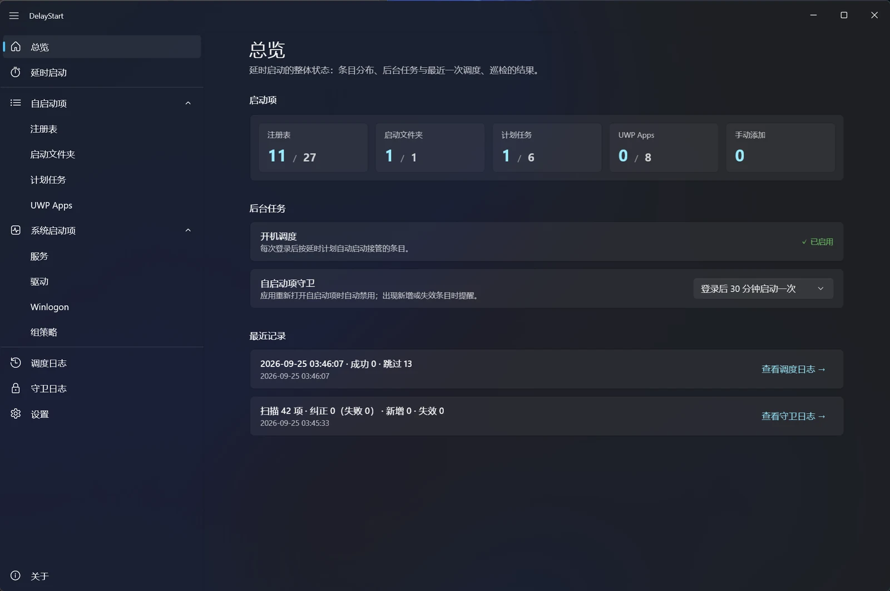
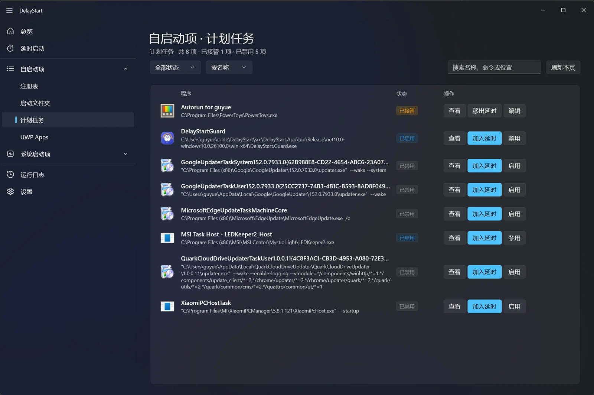
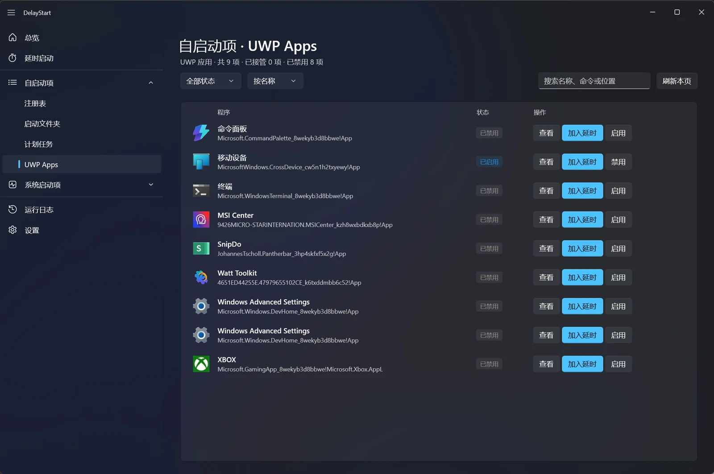
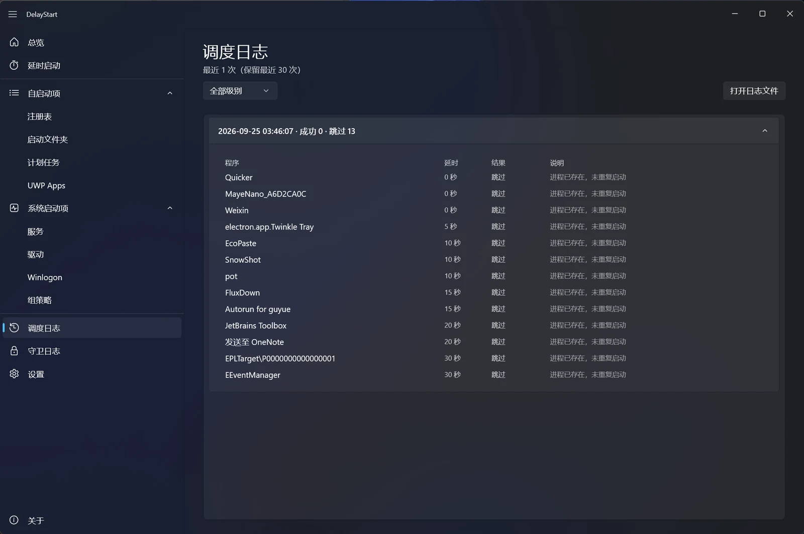
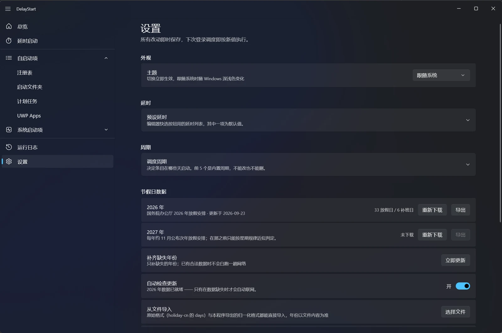

# DelayStart

**Windows 开机自启动的错峰管理器**

扫描全部自启动位置 → 软禁用（不删任何数据）→ 由独立调度进程按你设定的延时逐个启动，
并由**自启动项守卫**持续看护。

**[下载安装包](https://github.com/FanchangWang/DelayStart/releases/latest)** · [快速上手](#快速上手) · [常见问题](#常见问题) · [文档](#文档)

---

## 它解决什么问题

Windows 的自启动是全有或全无的：要么所有程序在登录瞬间一起抢资源，让桌面卡上一分钟；要么彻底禁用，从此忘了它的存在。**DelayStart 给第三种选择 —— 晚 10 秒、晚 30 秒、晚 2 分钟再启动。**

| | 不做处理 | 用 DelayStart |
|---|---|---|
| 登录瞬间 | 十几个程序同时抢磁盘和 CPU，桌面卡一分钟 | 只启动必要的几个，其余排队 |
| 启动顺序 | 系统决定，不可控 | 按延时值排序，可精确到秒 |
| 不想要的自启项 | 只能删掉，之后想用还得自己去找回来 | 软禁用：随时一键还原 |
| 出了问题 | 不知道哪个程序拖慢的 | 逐条记录启动结果与耗时 |

---

## 界面速览

| 总览 | 延时启动 |
|---|---|
|  |  |

<strong>更多界面</strong>（四个自启动来源页 · 调度日志 · 守卫日志 · 设置）

**自启动项** —— 注册表 / 启动文件夹 / 计划任务 / UWP 四个来源页，统一的接管视图与操作列：

---

## 核心特性

- **全部可逆** —— 禁用 = 写一个"软禁用标记"，**绝不删除注册表值、绝不移动你的文件**，随时还原到接管前的状态。
- **按天排期** —— 每个条目挑一个「调度周期」决定这次登录要不要启它：内置「每天 / 周一至周五 / 周六日 / 法定工作日 / 法定节假日」，也可以建自己的命名周期（比如「上一休一」）。改一处周期，所有用到它的条目一起生效。
- **跟着国家放假走** —— 「法定工作日 / 法定节假日」读的是国务院放假安排：调休补班日（周日也算上班）照常启动，法定假日不打扰你。数据下载后存在本机，**调度时不联网**，取不到数据就退回按星期规律判断并如实告诉你。
- **精确时序** —— 延时是"相对登录时刻的绝对时间点"，不是依次累加；能准确告诉你第几秒启动，而不是"大概"。
- **不替你做决定** —— 启动失败只提醒、不自动改系统状态；所有会改变系统行为的动作，出口都在你手上。
- **覆盖面广** —— 注册表 Run 项、启动文件夹、计划任务、UWP 应用、任意 exe/lnk 手动添加。
- **轻量调度** —— 调度进程是 NativeAOT 原生程序，约 3.5 MB、冷启动 0.3 秒内，跑完即退。
- **自启动项守卫** —— 软件升级有时会偷偷把自己重新加回开机启动，卸载的软件会留下永远启动失败的"僵尸条目"。守卫定期巡检：把被改回来的重新禁用，并用系统通知提醒你（可关闭）。
- **失败可见** —— 每个条目的启动结果、耗时、失败原因都落盘，调度日志里逐条可查。

---

## 安装

**per-user 安装，安装过程不弹 UAC**（不写系统目录，程序装在 `%LOCALAPPDATA%\Programs\DelayStart`）。

**[前往 Releases 下载](https://github.com/FanchangWang/DelayStart/releases/latest)** —— 安装包分两种形态 × 两种架构（x64 / arm64），共 4 个，由 CI 在打 tag 时产出：

| 形态 | 体积 | 说明 |
|---|---|---|
| **自包含版** | 约 60 MB | 自带 .NET 运行时，装完即用，不依赖系统装过什么 |
| **精简版** | 约 10 MB | 依赖系统已装 .NET 10 运行时；缺运行库时安装器会提示并给出下载入口 |

**静默安装**（供批量部署）：与图形安装一致，桌面图标默认创建；不想创建可加参数 `/MERGETASKS="!desktopicon"`。

**卸载**：先从控制面板正常卸载。卸载程序会**先还原所有接管项**，还原失败会中止卸载而不是硬删文件 —— 你的自启动项不会因为卸载而丢失。卸载时可选是否一并删除配置与日志（默认保留）；脚本化卸载可加 `/VERYSILENT` 静默执行，需要连数据一起删再追加 `/DELETEDATA`。

---

## 快速上手

1. **启动管理端** —— 首次运行会自动扫描本机全部自启动位置（需要管理员权限，见 [FAQ](#常见问题)）。
2. **看清单** —— 「启动项」页按来源列出所有自启项，可以筛选、搜索。
3. **设置延时** —— 把想延后的项拖进「延时启动」页，给每项配一个延时值（预设 `0/5/10/15/20/30/60` 秒，也可以自己填）。
4. **做完了** —— 不需要点"应用"。下次登录时，调度进程会按延时逐个启动它们。

**中途想改主意**：

- 想立刻看效果 → 调度端托盘右键「立即启动剩余任务」。
- 只想在工作日启动它 → 在编辑弹窗里给它挑一个**「调度周期」**（内置「周一至周五」，或者自己建一个「上一休一」这样的命名周期）。
- 某项不想延后了 → 在「延时启动」页把它**移出**，自启动状态会精确还原到接管前。
- 全部放弃 → 卸载，或在设置里重置。

**运行中会发生什么**：登录 3 秒后调度进程被拉起，托盘出现一个小图标，鼠标悬停能看到"已启动 3/8 · 下一项 12 秒"。跑完之后它会按「通知策略」发一条 Windows 系统通知（默认只有失败才发），然后自动退出。想看实时进度，点一下托盘图标即可弹出进度面板。完成情况任何时候都能在「调度日志」页查。

---

## 数据与隐私

程序与数据严格分离，**运行时绝不向安装目录写东西**，所以覆盖升级和卸载都不会留残留：

| 类别 | 路径 |
|---|---|
| 程序（只读） | `%LOCALAPPDATA%\Programs\DelayStart\` |
| 配置 | `%APPDATA%\DelayStart\config.json` |
| 日志 / 调度数据 / 守卫数据 | `%LOCALAPPDATA%\DelayStart\logs\` · `scheduler\`（实时状态与运行归档） · `guard\`（基线与巡检归档） |
| 节假日日历缓存 | `%LOCALAPPDATA%\DelayStart\holidays\{年份}.json`（可手工替换 / 校正，设置页有「打开数据目录」） |

**不联网、不采集、不上报**。所有数据都在本机，删掉配置目录即彻底清除。唯一会联网的只有管理端的节假日数据更新（由你手动触发或「自动检查更新」开关驱动），**调度与守卫进程永远不联网**。

---

## 扫描范围

| 来源 | 位置 | 可延时启动 |
|---|---|---|
| 注册表 | `HKCU` / `HKLM` / `HKLM\WOW6432Node` 的 `CurrentVersion\Run` | ✅ |
| 启动文件夹 | 用户 / 系统 `Startup` 目录（`.lnk` / `.url`） | ✅ |
| 计划任务 | 带 `LogonTrigger` / `BootTrigger` 的任务 | ✅ |
| UWP 应用 | `AppModel\SystemAppData` | ⚠️ 受限（见 FAQ） |
| 手动添加 | 任意 exe / lnk / bat / cmd / ps1 | ✅ |
| 系统服务 | — | ❌ 用 Windows 原生「延迟自动启动」，不由本程序接管 |
| 驱动 / Winlogon / 登录脚本 | — | ❌ 只读展示，不可操作 |

---

## 常见问题

<strong>为什么需要管理员权限？</strong>

读 `HKLM` 下的自启动项、操作计划任务、改 UWP 的启动状态，都必须管理员身份。核心链路 100% 依赖它，所以是全程提权，而不是运行到一半再弹一次 UAC。

<strong>接管之后，我还能手动打开那个程序吗？</strong>

能。接管只动"开机自启"这件事，程序本身、快捷方式、文件都没有被改动。

<strong>接管之后，软件又把自己加回开机启动了怎么办？</strong>

这是很常见的现象 —— 软件升级或重装后，往往会把"开机自启"重新打开。所以有一个**自启动项守卫**在定期巡检（默认登录后 30 分钟一次）：发现被你接管的项被改回启用，就重新禁用它，并把这次纠正记进日志。它是开机自启、跑完即退的小程序，不常驻、不占资源。

<strong>守卫发现有软件偷偷加了自启动，会怎么提醒我？</strong>

它会在**右下角发一条 Windows 系统通知**（标题是 DelayStart），列出新增 / 失效的启动项。这条通知**不会打断你** —— 横幅几秒后自己消失，内容留在通知中心里，你想起来再点；点它会直接打开管理端并跳到对应页面。**没有变化就安静退出**（任何时候都能在日志里看到它跑过一次）。

不想收到提醒的话：**设置 → 守卫 → 通知策略** 选「从不通知」—— 注意这只关掉提醒，**巡检与纠正照常进行**，只是不打扰你。档位在总览页调整：关闭 / 登录后执行一次 / 每隔 10、30、60 分钟一次。

<strong>守卫说某个启动项"已失效"是什么意思？我在哪里处理它？</strong>

两种情况：你接管过的那个软件被卸载了（系统的启动项已经没了），或者它的程序文件已经不在了。这类条目**就在「延时启动」页里**，行上的「启用」列不显示开关、改显示"已失效"。右侧有两个出口：

- **删除** —— 从列表里删掉这条记录。只改本程序的配置，不动系统任何设置。
- **转为手动** —— 程序还在、只是原来自启动项没了的时候才有这个按钮。转完之后它变成一个普通的手动条目，仍然按你设的延时启动它，只是不再和系统里的任何东西关联。

<strong>内容有变化时能不能悄悄处理、不通知我？</strong>

能。「从不通知」下守卫照样扫描、照样把被改回启用的项重新禁用，只是不发通知。想看它做过什么，打开**守卫日志**页（或看 `%LOCALAPPDATA%\DelayStart\logs\guard.log` 文件）就行。

<strong>调度跑完后的完成通知怎么开关？</strong>

**设置 → 调度 → 通知策略**：默认「有失败时通知」（全成功不打扰），也可选「总是通知」或「从不通知」。它是 Windows 系统通知（和守卫的提醒一个形态），点一下直达调度日志页。进度面板与通知互不影响：想看实时进度随时点托盘图标弹出面板，面板关没关都不影响通知照常发。

<strong>「延时启动 UWP」是什么意思？</strong>

UWP 应用的自启动由系统调度，第三方**无法延后**它。所以对 UWP 做的是"禁用系统自启 + 到点由本程序激活"—— 效果达到了，但确实绕过了系统的启动管理，UI 里也如实标注了这一点。

<strong>会不会让开机更慢？</strong>

不会。调度进程自己只有 3.5 MB、0.3 秒内启动完，它做的事是把原来同时抢资源的程序**错开**，总时长通常比原来短。

<strong>某项启动失败了怎么办？</strong>

记录失败原因并保留接管状态，不自动处理 —— 失败会发一条系统通知，详情在「调度日志」里。软件不会替你改系统状态，也不会统计你失败了几次；怎么处理由你决定。

<strong>怎么彻底还原？</strong>

卸载即还原（卸载程序会先还原全部接管项）。也可以随时用命令行 `DelayStart.exe --restore-all` 单独还原。

<strong>「调度周期」和「法定节假日」是怎么算的？</strong>

每个延时条目都挂着一个**周期**，决定"这次登录要不要启它"。内置五档：每天 / 周一至周五 / 周六日 / 法定工作日 / 法定节假日；也可以在 设置 → 周期 里建自己的命名周期（比如「上一休一」）。条目是**引用**周期：改一处，所有用到它的条目一起变；还在被引用的周期不允许删除。

「法定工作日 / 法定节假日」看的是**国务院公布的放假安排**（含调休补班日，所以某个周日也可能算工作日）。这份数据由管理端联网取回、存在本机，**调度时完全不联网** —— 万一还没取到当年的数据，程序会退回按星期规律判断，并在列表徽标和设置页如实标注，不会闷声按错的算。数据可以在 设置 → 节假日数据 里手动重新下载、补齐缺失年份，或**从文件导入**（直接支持上游 `NateScarlet/holiday-cn` 的原始 JSON）。

今天不启动的条目**不会从列表里消失**：程序名旁挂一枚「今天不启动」徽章，鼠标悬停告诉你周期和原因；调度日志里也会留一行「跳过」，不会出现"日志一片空白、不知道发生了什么"。

---

## 开源致谢

DelayStart 站在这些开源项目的肩膀上：

| 项目 | 用途 | 许可证 |
|---|---|---|
| [Windows App SDK（WinUI 3）](https://github.com/microsoft/WindowsAppSDK) | 应用框架与整个界面 | MIT |
| [CommunityToolkit.Mvvm](https://github.com/CommunityToolkit/dotnet) | MVVM 框架（源生成器） | MIT |
| [CommunityToolkit.WinUI](https://github.com/CommunityToolkit/Windows) | 设置页与关于页的卡片控件（SettingsCard） | MIT |
| [Microsoft.Extensions.DependencyInjection](https://github.com/dotnet/runtime) | 依赖注入容器 | MIT |
| [TaskScheduler](https://github.com/dahall/TaskScheduler) | Windows 计划任务的注册与读取 | MIT |
| [xUnit v3](https://github.com/xunit/xunit) | 单元测试框架 | Apache-2.0 |

「法定工作日 / 法定节假日」两档调度周期的判定数据来自 [NateScarlet/holiday-cn](https://github.com/NateScarlet/holiday-cn) —— 它依据国务院历年公布的放假安排整理。**特别感谢**该项目及其贡献者的长期维护。

---

## 文档

| 文档 | 内容 |
|---|---|
| [CHANGELOG.md](CHANGELOG.md) | 功能变更日志（GitHub Release 正文由 CI 按标签从本文件提取） |
| [docs/development.md](docs/development.md) | 环境要求、构建与测试、调试、发布打包、真机验收清单 |
| [docs/design.md](docs/design.md) | **当前方案单一事实来源**：需求、架构与关键机制、调度端交互、编码规范 |
| [docs/decisions.md](docs/decisions.md) | 每个决策的结论与取舍 |
| [docs/pitfalls.md](docs/pitfalls.md) | 踩坑大全：Win32 / 注册表 / 计划任务 / UWP / 降权 / AOT / WinUI 3 / 安装器 |
| [Agents.md](Agents.md) | AI 编码代理入口：硬约束、代码地图、命令速查、编号体系 |

## License

[MIT](LICENSE) © 2026 FanchangWang
